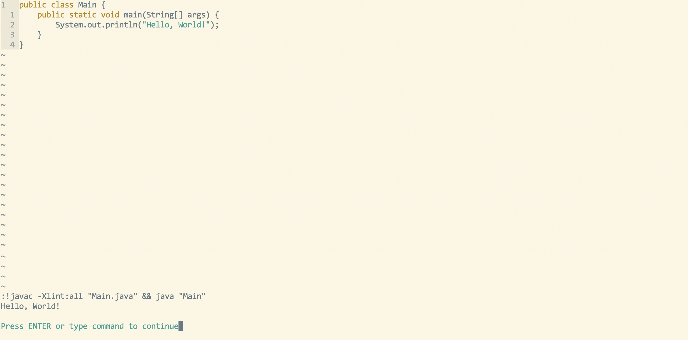

JavaCompile is a simple, easy plugin to compile, run java files on vim/neovim, it is made to facilitate the proccess instead of going to the command line to compile, run you file.
You only need to clone the repo in your neovim directory ~/.config/neovim/plugins/ and require the file name in your init.lua file.

